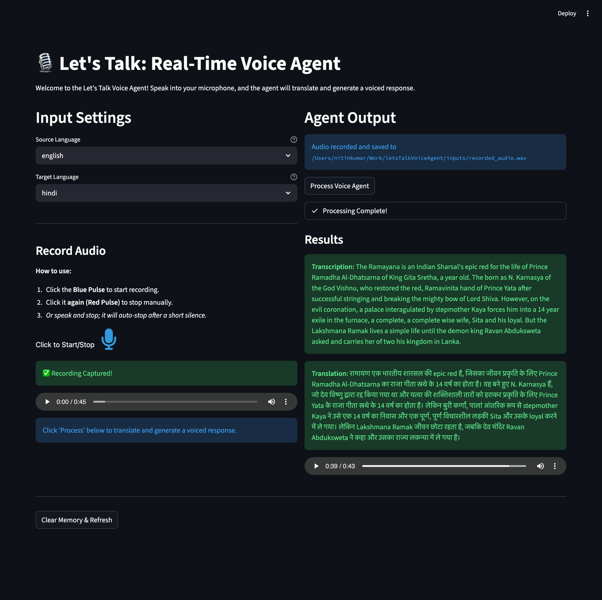

A high-performance, fully local, and open-source real-time voice translation agent built with **LangGraph** and **MLX-Audio**. This project specifically targets seamless **English to Hindi** (and vice versa) voice translation with a sub-2-second latency goal.

## 🚀 Key Features

- **Agentic Workflow**: Orchestrated by **LangGraph** for modular, stateful execution.
- **Native MLX Support**: Optimized for Apple Silicon using `mlx-audio` for ASR and TTS.
- **Bi-directional Translation**: Supports both English -> Hindi and Hindi -> English translation.
- **Zero-Shot Voice Cloning**: Clones the source speaker's voice for the translated output using Qwen3-TTS.
- **Fully Local**: Runs entirely on your machine—no data leaves your device.
- **Resource Efficient**: Built-in memory management and cleanup nodes.

## 🛠️ Tech Stack

- **Orchestration**: `langgraph`
- **Speech-to-Text (STT)**: 
  - English: OpenAI Whisper Tiny (via `openai-whisper`)
  - Hindi: Whisper Tiny Hindi (via `transformers` pipeline)
- **Machine Translation (MT)**: Local LLM (e.g., Qwen 3.5) via `langchain-openai`
- **Text-to-Speech (TTS)**: Qwen3-TTS (0.6B) via `mlx-audio`
- **Hardware Acceleration**: Apple Silicon (MPS) optimized

## 📁 Project Structure

```text
.
├── src/
│   ├── pipeline.py            # Core MLX & LLM logic
│   ├── frontend.py            # Streamlit-based web interface
│   └── agent_langgraph.ipynb  # LangGraph implementation & demo
├── models/                    # Locally cached models
├── inputs/                    # Input audio files for testing
├── outputs/                   # Generated translated audio
├── agents.md                  # Detailed agent architecture documentation
├── README.md                  # Project overview
├── project_screenshot.png     # Visual overview of the application
└── pyproject.toml             # Dependency management (uv)
```

## ⚙️ Quick Start

### 1. Prerequisites
- **Python 3.10+** (Recommended: 3.12)
- **uv**: Fast Python package manager
- **Local LLM Server**: LM Studio, Ollama, or vLLM running an OpenAI-compatible API.

### 2. Installation
```bash
# Clone the repository
git clone <repository-url>
cd letsTalkVoiceAgent

# Setup environment
uv sync
source .venv/bin/activate
```

### 3. Environment Variables
Copy `.env.example` to `.env` and configure your environment:
```bash
HF_TOKEN=''
LOCAL_LLM_URL=http://127.0.0.1:1234/v1
ASR_MODEL_EN=openai/whisper-tiny
ASR_MODEL_HI=collabora/whisper-tiny-hindi
TTS_MODEL=chatterbox-4bit
LLM_MODEL=qwen3.5-0.8b
HF_HUB_CACHE="/models/hub"
```

## 📖 Usage

### Web Interface
Run the Streamlit frontend for an interactive experience:
```bash
streamlit run src/frontend.py
```

### Notebook Demo
Run the `agent_langgraph.ipynb` notebook to see the agent flow in detail.

For details on the agent architecture, see [agents.md](./agents.md).

## 🗺️ Roadmap

- [x] **UI Frontend**: A clean web interface for interaction.
- [ ] **FastAPI Integration**: Expose the agent via a REST API.
- [ ] **WebSocket Support**: Real-time streaming for continuous conversation.
- [ ] **Fine-tuned Translation**: Improving translation accuracy for specific domains.

---
