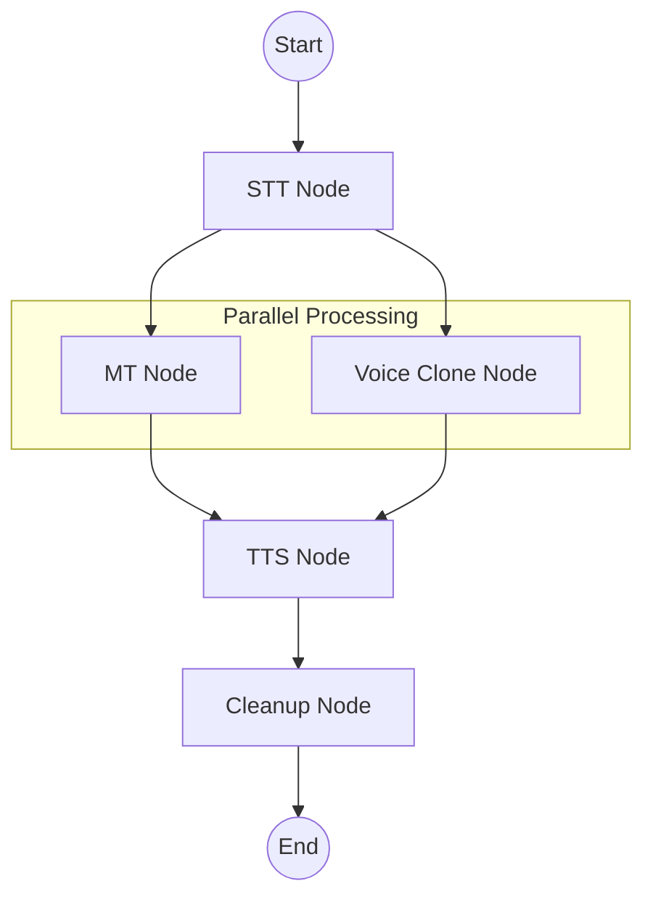

# LangGraph Voice Agent Architecture

This document details the agentic workflow of the **Let's Talk Voice Agent**, implemented using [LangGraph](https://github.com/langchain-ai/langgraph).

## workflow Overview

The agent follows a stateful, modular flow designed for high-performance voice translation. It orchestrates Speech-to-Text (STT), Machine Translation (MT), and Text-to-Speech (TTS) components while managing system resources and optional features like voice cloning.

### Architecture Diagram

## Agent State (`AgentState`)

The workflow maintains a persistent state throughout the execution:

| Field | Type | Description |
| :--- | :--- | :--- |
| `audio_path` | `str` | Path to the input audio file. |
| `src_lang` | `str` | Spoken language in the input (e.g., "english"). |
| `tgt_lang` | `str` | Desired target language (e.g., "hindi"). |
| `out_audio_path` | `str` | Directory where the output audio will be saved. |
| `original_text` | `str` | Raw transcription from the STT node. |
| `translated_text`| `str` | Translated text from the MT node. |
| `ref_audio_path` | `Optional[str]` | Path to the 3-second reference clip for voice cloning. |
| `metrics` | `Dict` | Performance tracking (latencies for each stage). |

## Workflow Nodes

### 1. STT Node (Speech-to-Text)
- **Models**: 
  - **English**: OpenAI Whisper Tiny via `openai-whisper`.
  - **Hindi**: Whisper Tiny Hindi via `transformers.pipeline`.
- **Function**: Transcribes the input audio into text.
- **Optimization**: Uses MPS acceleration on Apple Silicon for English and standard CPU/GPU for Hindi.

### 2. MT Node (Machine Translation)
- **Model**: Local LLM (e.g., Qwen-3.5-0.8B).
- **Function**: Translates the transcribed text between English and Hindi.
- **Communication**: Interfaces via an OpenAI-compatible API (LM Studio, Ollama, etc.).

### 3. Voice Clone Node
- **Function**: Analyzes the source audio. If it's longer than 3 seconds, it extracts a clip (up to 7 seconds) to be used as a reference for voice cloning in the TTS stage.
- **Parallelism**: Runs concurrently with the MT node to reduce total end-to-end latency.

### 4. TTS Node (Text-to-Speech)
- **Model**: Qwen3-TTS (0.6B) via `mlx-audio`.
- **Function**: Generates the final translated audio in the target language.
- **Voice Cloning**: If a reference clip was generated, it uses it for zero-shot voice cloning, making the agent sound like the original speaker.

### 5. Cleanup Node
- **Function**: Deletes temporary files (like the voice clone reference clip) and clears models from memory (`del` + `gc.collect()`) to prevent resource leakage on Apple Silicon.
